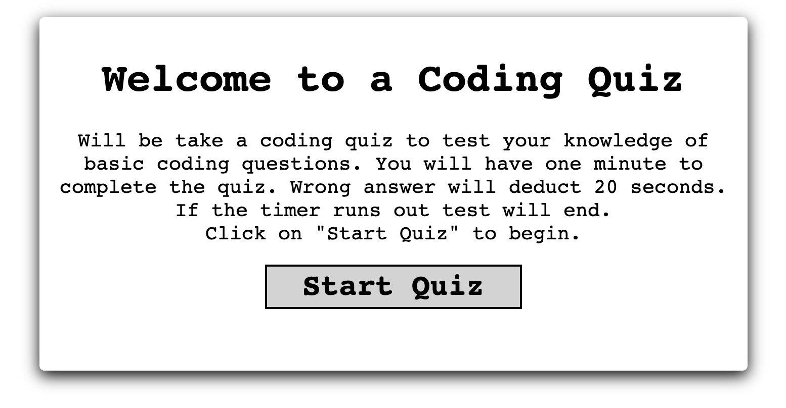
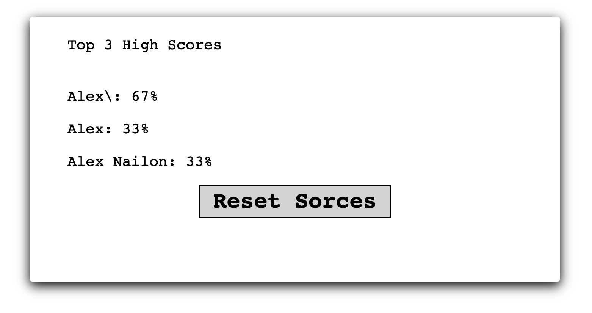

# code-quiz

## Summary
code-quiz using the power of js to be able to go through an array of questions and show the users score and give the user the ablity to save their score and display the top 3 scores that were completed in the users device using local storage.

## Deployed Webpag
Link to webpage: [code-quiz](https://alex-bailon.github.io/code-quiz/)

## Conclusion
With the use of functions and objects I was able to successfully build and run a quiz and store users name and score into local storage to be able to keep track of the top 3 scores. A possible future goal for this project could be to have both local and global high scores.
